<!--
  If you're reading this in raw form:
  Hey there. You must be impressed.
  Follow me.
  Or, you know, don't.
  Whatever you want.
  But if you ask what I want, I say:
  Follow me.
  ... Go back to line 5.
-->

# 👋 Hey, I’m Simi
**Web and Desktop App Developer**  

This README exists because GitHub profiles without one feel unfinished.
Also because silence is suspicious.

---

## 🌍 Stats, Because Numbers Are Persuasive

  

---

## 🌐 On the Internet

- **Website:** https://simicodes.xyz  
- **Featured project:** Stickee  
  - App: https://stickee.simicodes.xyz  
  - Info: https://stickee-info.simicodes.xyz  

   A modern web and desktop application for managing and organizing your digital sticky notes and tasks in an easy and fun way. 

---

## 🧰 Tools I Use

Because listing everything at once is just too long:

  
<strong>Click if you enjoy lists. Or even if you don't.</strong>

### Languages & Tech I Actually Use
- Kotlin  
- Dart  
- Flutter  
- Python  
- TypeScript  
- JavaScript  
- Rust  
- Go  
- HTML  
- CSS  
- Shell  
- Whatever gets the job done  

---
## 📦 What You’ll Find Here

Mostly unfinished ideas that became useful enough to keep.

---

### Thanks for stopping by 😁
If something here helps you, steals your idea, or anything else to annoy you - mission accomplished.

### 🫡 Thanks to my followers:

<!--START_SECTION:top-followers-->
<table>
  <tr>
    <td align="center">
      
       
      <a href="https://github.com/h0011000">h0011000</a>
    </td>
    <td align="center">
      
       
      <a href="https://github.com/ez0000001000000">ez0000001000000</a>
    </td>
    <td align="center">
      
       
      <a href="https://github.com/as000010000">as000010000</a>
    </td>
  </tr>
</table>
<!--END_SECTION:top-followers-->
