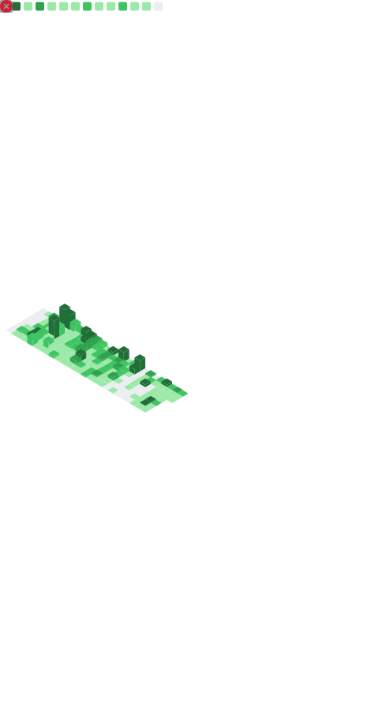

<!--
  If you're reading this in raw form:
  Hey there. You must be impressed.
  Follow me.
  Or, you know, don't.
  Whatever you want.
  But if you ask what I want, I say:
  Follow me.
  ... Go back to line 5.
-->

  
# 👋 𝙷𝚎𝚢, 𝙸’𝚖 𝚂𝚒𝚖𝚒
**𝚆𝚎𝚋 𝚊𝚗𝚍 𝙳𝚎𝚜𝚔𝚝𝚘𝚙 𝙰𝚙𝚙 𝙳𝚎𝚟𝚎𝚕𝚘𝚙𝚎𝚛**  

𝚃𝚑𝚒𝚜 𝚁𝙴𝙰𝙳𝙼𝙴 𝚎𝚡𝚒𝚜𝚝𝚜 𝚋𝚎𝚌𝚊𝚞𝚜𝚎 𝙶𝚒𝚝𝙷𝚞𝚋 𝚙𝚛𝚘𝚏𝚒𝚕𝚎𝚜 𝚠𝚒𝚝𝚑𝚘𝚞𝚝 𝚘𝚗𝚎 𝚏𝚎𝚎𝚕 𝚞𝚗𝚏𝚒𝚗𝚒𝚜𝚑𝚎𝚍.

𝙰𝚕𝚜𝚘 𝚋𝚎𝚌𝚊𝚞𝚜𝚎 𝚜𝚒𝚕𝚎𝚗𝚌𝚎 𝚒𝚜 𝚜𝚞𝚜𝚙𝚒𝚌𝚒𝚘𝚞𝚜.

---

## 🌍 𝚂𝚝𝚊𝚝𝚜, 𝙱𝚎𝚌𝚊𝚞𝚜𝚎 𝙽𝚞𝚖𝚋𝚎𝚛𝚜 𝙰𝚛𝚎 𝙿𝚎𝚛𝚜𝚞𝚊𝚜𝚒𝚟𝚎

  

## 🌐 𝙾𝚗 𝚝𝚑𝚎 𝙸𝚗𝚝𝚎𝚛𝚗𝚎𝚝
- **𝚆𝚎𝚋𝚜𝚒𝚝𝚎:** [𝚜𝚒𝚖𝚒𝚌𝚘𝚍𝚎𝚜.𝚡𝚢𝚣](https://simicodes.xyz)
- **𝙵𝚎𝚊𝚝𝚞𝚛𝚎𝚍 𝚙𝚛𝚘𝚓𝚎𝚌𝚝:** 𝚂𝚝𝚒𝚌𝚔𝚎𝚎
  - 𝙶𝚒𝚝𝚑𝚞𝚋: [𝚑𝚝𝚝𝚙𝚜://𝚐𝚒𝚝𝚑𝚞𝚋.𝚌𝚘𝚖/𝚜𝚕𝚊𝚖𝚖𝚎𝚛𝚜00𝟷/𝚜𝚝𝚒𝚌𝚔𝚎𝚎](𝚑𝚝𝚝𝚙𝚜://𝚐𝚒𝚝𝚑𝚞𝚋.𝚌𝚘𝚖/𝚜𝚕𝚊𝚖𝚖𝚎𝚛𝚜00𝟷/𝚜𝚝𝚒𝚌𝚔𝚎𝚎)
  - 𝙰𝚙𝚙: [𝚜𝚝𝚒𝚌𝚔𝚎𝚎.𝚜𝚒𝚖𝚒𝚌𝚘𝚍𝚎𝚜.𝚡𝚢𝚣](https://stickee.simicodes.xyz)
  - 𝙸𝚗𝚏𝚘: [𝚑𝚝𝚝𝚙𝚜://𝚜𝚝𝚒𝚌𝚔𝚎𝚎-𝚒𝚗𝚏𝚘.𝚜𝚒𝚖𝚒𝚌𝚘𝚍𝚎𝚜.𝚡𝚢𝚣](https://stickee-info.simicodes.xyz)
  - 

    
𝚂𝚌𝚛𝚎𝚎𝚗𝚜𝚑𝚘𝚝:

    
   ###### 𝙽𝚘𝚝𝚎 𝚝𝚑𝚊𝚝 𝚝𝚑𝚎 𝚊𝚋𝚘𝚟𝚎 𝚜𝚌𝚛𝚎𝚎𝚗𝚜𝚑𝚘𝚝 𝚒𝚜 𝚟0.0.𝟷 𝚠𝚑𝚒𝚕𝚎 𝚂𝚝𝚒𝚌𝚔𝚎𝚎 𝚒𝚜 𝚌𝚞𝚛𝚛𝚎𝚗𝚝𝚕𝚢 𝚊𝚝 𝚟𝟸.0.0

  

   𝙰 𝚖𝚘𝚍𝚎𝚛𝚗 𝚠𝚎𝚋 𝚊𝚗𝚍 𝚍𝚎𝚜𝚔𝚝𝚘𝚙 𝚊𝚙𝚙𝚕𝚒𝚌𝚊𝚝𝚒𝚘𝚗 𝚏𝚘𝚛 𝚖𝚊𝚗𝚊𝚐𝚒𝚗𝚐 𝚊𝚗𝚍 𝚘𝚛𝚐𝚊𝚗𝚒𝚣𝚒𝚗𝚐 𝚢𝚘𝚞𝚛 𝚍𝚒𝚐𝚒𝚝𝚊𝚕 𝚜𝚝𝚒𝚌𝚔𝚢 𝚗𝚘𝚝𝚎𝚜 𝚊𝚗𝚍 𝚝𝚊𝚜𝚔𝚜 𝚒𝚗 𝚊𝚗 𝚎𝚊𝚜𝚢 𝚊𝚗𝚍 𝚏𝚞𝚗 𝚠𝚊𝚢. 

  
<strong>𝙲𝚕𝚒𝚌𝚔 𝚒𝚏 𝚢𝚘𝚞 𝚎𝚗𝚓𝚘𝚢 𝚕𝚒𝚜𝚝𝚜. 𝙾𝚛 𝚎𝚟𝚎𝚗 𝚒𝚏 𝚢𝚘𝚞 𝚍𝚘𝚗'𝚝.</strong>

  
### 𝙻𝚊𝚗𝚐𝚞𝚊𝚐𝚎𝚜 & 𝚃𝚎𝚌𝚑 𝙸 𝙰𝚌𝚝𝚞𝚊𝚕𝚕𝚢 𝚄𝚜𝚎
- 𝙺𝚘𝚝𝚕𝚒𝚗  
- 𝙳𝚊𝚛𝚝  
- 𝙵𝚕𝚞𝚝𝚝𝚎𝚛  
- 𝙿𝚢𝚝𝚑𝚘𝚗  
- 𝚃𝚢𝚙𝚎𝚂𝚌𝚛𝚒𝚙𝚝  
- 𝙹𝚊𝚟𝚊𝚂𝚌𝚛𝚒𝚙𝚝  
- 𝚁𝚞𝚜𝚝  
- 𝙶𝚘  
- 𝙷𝚃𝙼𝙻  
- 𝙲𝚂𝚂  
- 𝚂𝚑𝚎𝚕𝚕  
- 𝚆𝚑𝚊𝚝𝚎𝚟𝚎𝚛 𝚐𝚎𝚝𝚜 𝚝𝚑𝚎 𝚓𝚘𝚋 𝚍𝚘𝚗𝚎  

## 📦 𝚆𝚑𝚊𝚝 𝚈𝚘𝚞’𝚕𝚕 𝙵𝚒𝚗𝚍 𝙷𝚎𝚛𝚎

𝙼𝚘𝚜𝚝𝚕𝚢 𝚞𝚗𝚏𝚒𝚗𝚒𝚜𝚑𝚎𝚍 𝚒𝚍𝚎𝚊𝚜 𝚝𝚑𝚊𝚝 𝚋𝚎𝚌𝚊𝚖𝚎 𝚞𝚜𝚎𝚏𝚞𝚕 𝚎𝚗𝚘𝚞𝚐𝚑 𝚝𝚘 𝚔𝚎𝚎𝚙.

### 🫡 𝚃𝚑𝚊𝚗𝚔𝚜 𝚝𝚘 𝚖𝚢 𝚏𝚘𝚕𝚕𝚘𝚠𝚎𝚛𝚜:
###### 𝙸𝚗 𝚘𝚛𝚍𝚎𝚛 𝚘𝚏 𝚖𝚘𝚜𝚝 𝚛𝚎𝚌𝚎𝚗𝚝:

<!--START_SECTION:top-followers-->
<table>
  <tr>
    <td align="center">
      
       
      <a href="https://github.com/Mikasa1013">Mikasa1013</a>
    </td>
    <td align="center">
      
       
      <a href="https://github.com/theplagueman">theplagueman</a>
    </td>
    <td align="center">
      
       
      <a href="https://github.com/ChristianPeritore">ChristianPeritore</a>
    </td>
    <td align="center">
      
       
      <a href="https://github.com/duzric">duzric</a>
    </td>
    <td align="center">
      
       
      <a href="https://github.com/ahmedali22221193-art">ahmedali22221193-art</a>
    </td>
    <td align="center">
      
       
      <a href="https://github.com/phoenix-dev08">phoenix-dev08</a>
    </td>
  </tr>
  <tr>
    <td align="center">
      
       
      <a href="https://github.com/honestv01">honestv01</a>
    </td>
    <td align="center">
      
       
      <a href="https://github.com/bloodbxnny">bloodbxnny</a>
    </td>
    <td align="center">
      
       
      <a href="https://github.com/dayofthedeparted">dayofthedeparted</a>
    </td>
    <td align="center">
      
       
      <a href="https://github.com/aibers">aibers</a>
    </td>
    <td align="center">
      
       
      <a href="https://github.com/as000010000">as000010000</a>
    </td>
    <td align="center">
      
       
      <a href="https://github.com/ez0000001000000">ez0000001000000</a>
    </td>
  </tr>
  <tr>
    <td align="center">
      
       
      <a href="https://github.com/h0011000">h0011000</a>
    </td>
    <td align="center">
      
       
      <a href="https://github.com/Tony-aphrodite">Tony-aphrodite</a>
    </td>
    <td align="center">
      
       
      <a href="https://github.com/jaiq123">jaiq123</a>
    </td>
    <td align="center">
      
       
      <a href="https://github.com/simegnew1213">simegnew1213</a>
    </td>
    <td align="center">
      
       
      <a href="https://github.com/ipqwery">ipqwery</a>
    </td>
    <td align="center">
      
       
      <a href="https://github.com/Bd-Mutant7">Bd-Mutant7</a>
    </td>
  </tr>
  <tr>
    <td align="center">
      
       
      <a href="https://github.com/Nauman-Irshad">Nauman-Irshad</a>
    </td>
    <td align="center">
      
       
      <a href="https://github.com/iamapuneet">iamapuneet</a>
    </td>
    <td align="center">
      
       
      <a href="https://github.com/JohnMwendwa">JohnMwendwa</a>
    </td>
    <td align="center">
      
       
      <a href="https://github.com/AyjayJr">AyjayJr</a>
    </td>
    <td align="center">
      
       
      <a href="https://github.com/Dvurechensky">Dvurechensky</a>
    </td>
    <td align="center">
      
       
      <a href="https://github.com/standardgalactic">standardgalactic</a>
    </td>
  </tr>
  <tr>
    <td align="center">
      
       
      <a href="https://github.com/CelaDaniel">CelaDaniel</a>
    </td>
    <td align="center">
      
       
      <a href="https://github.com/ishandutta2007">ishandutta2007</a>
    </td>
  </tr>
</table>
<!--END_SECTION:top-followers-->

  
### 𝚃𝚑𝚊𝚗𝚔𝚜 𝚏𝚘𝚛 𝚜𝚝𝚘𝚙𝚙𝚒𝚗𝚐 𝚋𝚢 😁
𝙴𝚖𝚊𝚒𝚕 𝚖𝚎: &nbsp;&nbsp;

